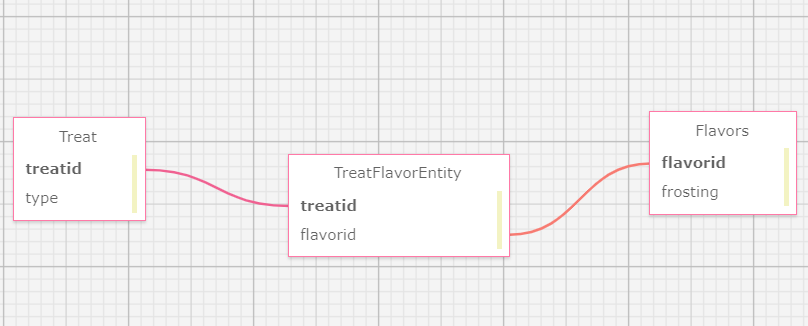

# _Pier is Back!_

#### _A nifty web tool I made to help an expanding modern bakery_

#### By Erik Z./Molagg92

## Technologies Used

* _C#_
* _.NET v6.0_
* _MSTest.TestAdapter v2.2.10_
* _MSTest.TestFramework v2.2.10_
* _Git_
* _VSCode_

## Description



_Users can register an account and keep track of wich treats and pastries they want to go with witch ever flavor! Full CRUD on both ends!_

## Setup/Installation Requirements

* _Clone "Week5CodeReview“ from the repository to your desktop_
* _Navigate to the Week5CodeReview folder in your terminal_
* _Once inside the project folder "Bakery", build an appsettings.json file, copy the following into it (replace the password with your server MySQL server passwor)_
* ```{
    "ConnectionStrings": {
      "DefaultConnection": "Server=localhost;Port=3306;database=[!!PROJECTNAME!!];uid=root;pwd=[!Yourpassword!];"
    }
  } ```
* _After this, give commane `$ dotnet ef database update` for the databade_ 
* _Then type `dotnet build` in your terminal to make sure everything is up to date and there are no errors_
* _Then launch the webpage by typing `dotnet watch run --launch-profile "production"` in the teminal_
* _For issuing and trusting a security certificate, type `dotnet dev-certs https --trust` in the terminal and restart your browser_

## Known Bugs

* _No known bugs as of 8/14/2023_

## License

MIT License

Copyright (c) [2023] [Erik Z.]

Permission is hereby granted, free of charge, to any person obtaining a copy
of this software and associated documentation files (the "Software"), to deal
in the Software without restriction, including without limitation the rights
to use, copy, modify, merge, publish, distribute, sublicense, and/or sell
copies of the Software, and to permit persons to whom the Software is
furnished to do so, subject to the following conditions:

The above copyright notice and this permission notice shall be included in all
copies or substantial portions of the Software.

THE SOFTWARE IS PROVIDED "AS IS", WITHOUT WARRANTY OF ANY KIND, EXPRESS OR
IMPLIED, INCLUDING BUT NOT LIMITED TO THE WARRANTIES OF MERCHANTABILITY,
FITNESS FOR A PARTICULAR PURPOSE AND NONINFRINGEMENT. IN NO EVENT SHALL THE
AUTHORS OR COPYRIGHT HOLDERS BE LIABLE FOR ANY CLAIM, DAMAGES OR OTHER
LIABILITY, WHETHER IN AN ACTION OF CONTRACT, TORT OR OTHERWISE, ARISING FROM,
OUT OF OR IN CONNECTION WITH THE SOFTWARE OR THE USE OR OTHER DEALINGS IN THE
SOFTWARE.

_If you run into any issues or have questions, ideas or concerns, please reach out to me via email: Molagg92@gmail.com.  Contributions to the code are highly encouraged._